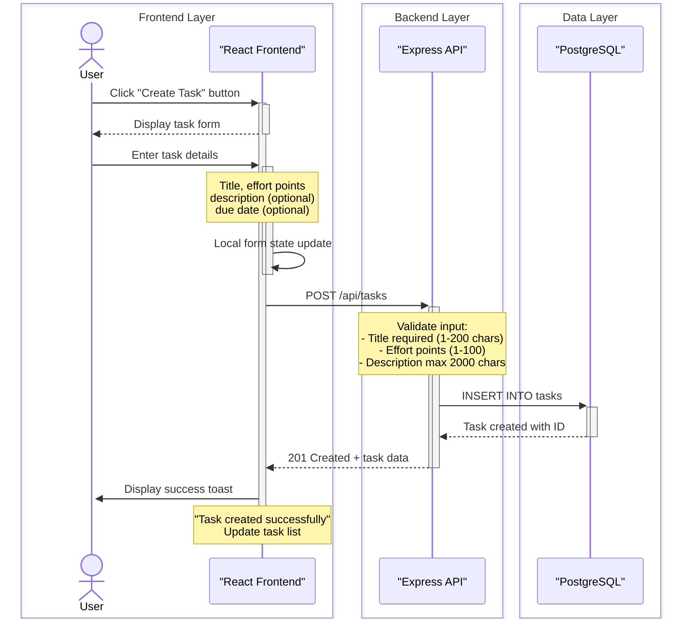
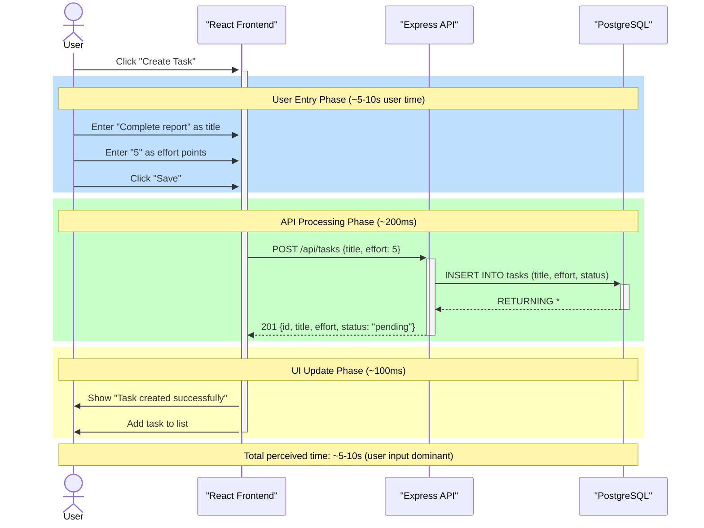
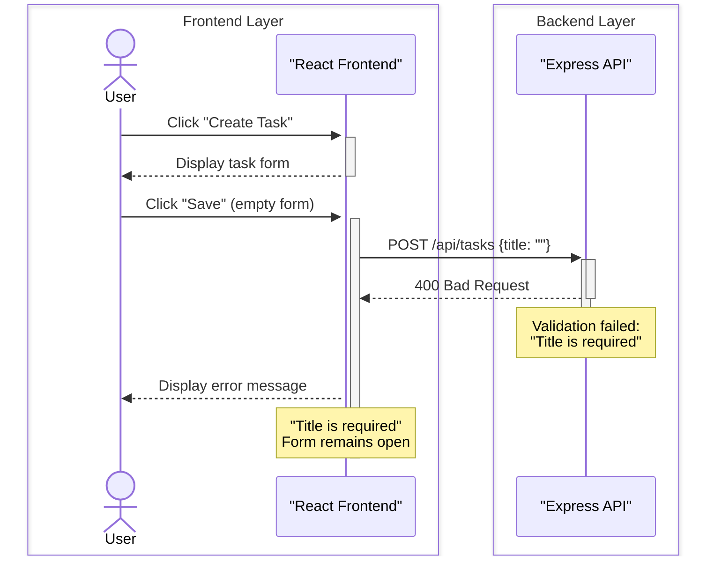

# Sequence Diagram - US-001: Create a New Task

## Happy Path Diagram (Layer Grouped)



## Success Path with Timing



## Error Path Diagram



## Complete Flow with ALT Fragment

```mermaid
sequenceDiagram
    box Frontend Layer
        actor User
        participant Client as "React Frontend"
    end

    box Backend Layer
        participant API as "Express API"
    end

    box Data Layer
        participant DB as "PostgreSQL"
    end

    User->>+Client: Click "Create Task"
    activate Client
    Client-->>User: Display empty task form
    deactivate Client

    User->>+Client: Fill form and click "Save"
    activate Client
    Client->>+API: POST /api/tasks
    deactivate Client
    activate API

    API->>API: Validate input
    Note over API: Self-call:<br/>- Check title length (1-200)<br/>- Validate effort (1-100)<br/>- Check description length (≤2000)

    alt Validation Success
        API->>+DB: INSERT INTO tasks (title, effort, description, due_date, status, user_id)
        activate DB
        DB-->>-API: Task object with ID
        deactivate DB
        API-->>-Client: 201 Created
        activate Client
        Client->>User: Show success toast<br/>Add task to dashboard
    else Validation Failure
        API-->>-Client: 400 Bad Request
        Note over Client: "Title is required"
    else Server Error
        API-->>-Client: 500 Internal Server Error
        Note over Client: "Something went wrong"
    end

    deactivate API
    deactivate Client
```

## Component Responsibilities

| Component | Responsibility |
|-----------|----------------|
| **React Frontend** | Capture user input, display forms/messages, handle UI state |
| **Express API** | Validate input, orchestrate database operations, return responses |
| **PostgreSQL** | Persist task data with timestamps and relationships |

## User Wait Metric

> [!IMPORTANT]
> The distance between the user's "Save" request and the final "Success toast" is the **User Wait Time**. In this flow:
> - **API Processing**: ~200ms (user perceives instant)
> - **UI Update**: ~100ms
> - **Total Backend Time**: ~300ms (well within 500ms UX SLO)
>
> The dominant time is user input (~5-10s), not backend processing.

## Message Summary

| Step | Message | Type | From → To | Activation |
|------|---------|------|-----------|------------|
| 1 | Click "Create Task" | Request | User → Client | Client activates |
| 2 | Form displayed | Response | Client → User | Client deactivates |
| 3 | Enter details | Async | User → Client | Client activates (self-call) |
| 4 | POST /api/tasks | Sync | Client → API | Client deactivates, API activates |
| 5 | INSERT query | Sync | API → DB | DB activates |
| 6 | Task created | Return | DB → API | DB deactivates |
| 7 | 201 Created | Return | API → Client | API deactivates, Client activates |
| 8 | Success toast | Display | Client → User | Client deactivates |

## Layer Boundaries

| Layer | Components | Responsibility |
|-------|------------|----------------|
| **Frontend** | User, React Client | User interaction, form state, toast notifications |
| **Backend** | Express API | Request validation, orchestration, business logic |
| **Data** | PostgreSQL | Persistent storage, data integrity |

## Performance Notes

| Metric | Target | Actual | Status |
|--------|--------|--------|--------|
| API Response (POST) | < 200ms p95 | ~200ms | ✅ Within SLO |
| Total Form Submission | < 500ms end-to-end | ~300ms | ✅ Within SLO |
| Database Write | < 50ms | ~20ms | ✅ Within Target |

### Latency Breakdown

```
User Click Save ──────► API receives request    (~10ms)
                                │
                                ▼
                         Validation logic        (~5ms)
                                │
                                ▼
                         DB INSERT query         (~20ms)
                                │
                                ▼
                         API returns 201         (~10ms)
                                │
                                ▼
                         UI shows toast          (~100ms)

Total Backend: ~200ms | Total E2E: ~300ms
```

---

*Document Version: 1.1*
*Created: 2026-04-18*
*Updated: 2026-04-19*
*Related User Story: US-001*
*Related Use Case: 01.us-001-create-task.md*
*Related Summary: 00.us-001-create-task-summary.md*
