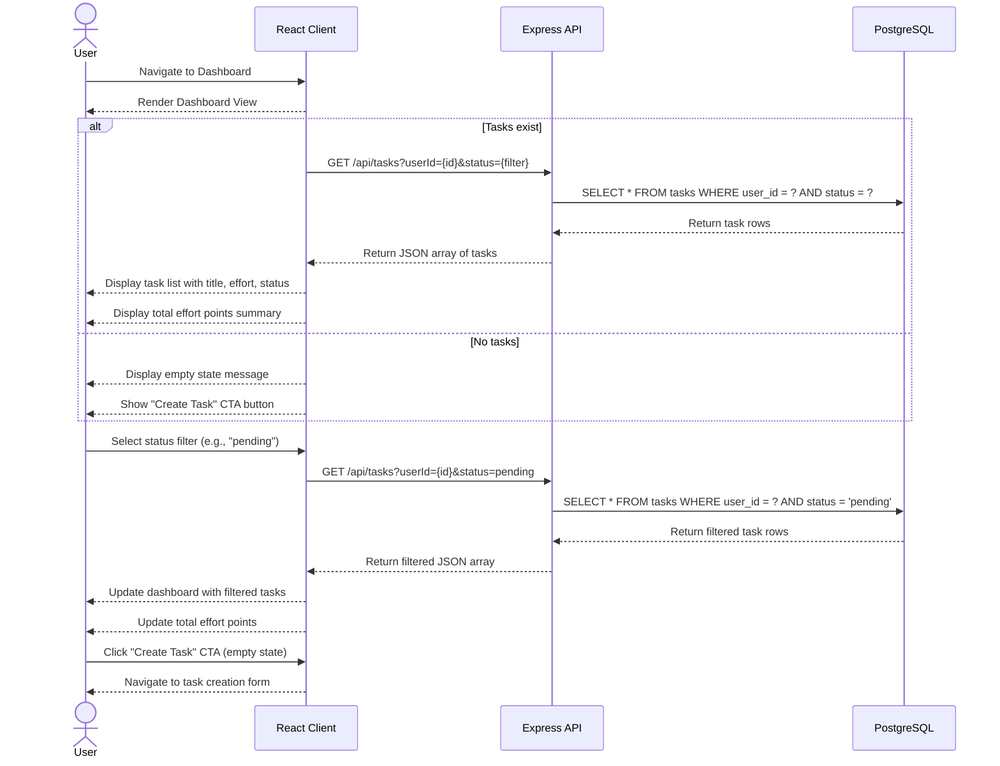

# Sequence Diagram - US-002: View Task Dashboard

## Diagram



## Step-by-Step Flow

### Step 1: User Navigates to Dashboard

User opens the dashboard URL. React client initializes and renders the dashboard view component.

### Step 2: Fetch Tasks (when tasks exist)

1. React calls `GET /api/tasks?userId={id}&status={filter}`
2. Express API receives request, validates user session
3. API queries PostgreSQL: `SELECT * FROM tasks WHERE user_id = ? AND status = ?`
4. Database returns task rows
5. API formats response and returns JSON array
6. React renders task list with title, effort points, status for each task
7. React calculates and displays total effort points

### Step 3: Filter Tasks

1. User selects status filter (all/pending/completed)
2. React calls API with updated filter parameter
3. API queries database with filter condition
4. API returns filtered results
5. React updates dashboard display

### Step 4: Empty State Path

When user has no tasks:
1. API returns empty array
2. React detects empty array
3. React renders empty state with message and CTA button

### Step 5: Navigate to Create (from empty state)

1. User clicks "Create Task" button
2. React navigates to task creation route
3. Task creation form renders

## API Contract

### GET /api/tasks

**Request:**
```
GET /api/tasks?userId={uuid}&status={all|pending|completed}
Headers:
  Content-Type: application/json
```

**Response (200 OK):**
```json
{
  "tasks": [
    {
      "id": "uuid",
      "title": "string",
      "description": "string|null",
      "effortPoints": 5,
      "status": "pending|completed",
      "dueDate": "2026-04-25|null",
      "createdAt": "2026-04-19T10:00:00Z",
      "updatedAt": "2026-04-19T10:00:00Z"
    }
  ],
  "totalEffortPoints": 10,
  "count": 3
}
```

**Response (empty):**
```json
{
  "tasks": [],
  "totalEffortPoints": 0,
  "count": 0
}
```

## Error Handling

| Error Scenario              | API Response | UI Behavior                    |
| --------------------------- | ------------ | ------------------------------ |
| Database connection failed  | 500          | Show "Failed to load tasks"    |
| Invalid userId format       | 400          | Show "Invalid request"         |
| User not authenticated      | 401          | Redirect to login page         |

---

_Document Version: 1.0_
_Created: 2026-04-19_
_Related User Story: US-002_